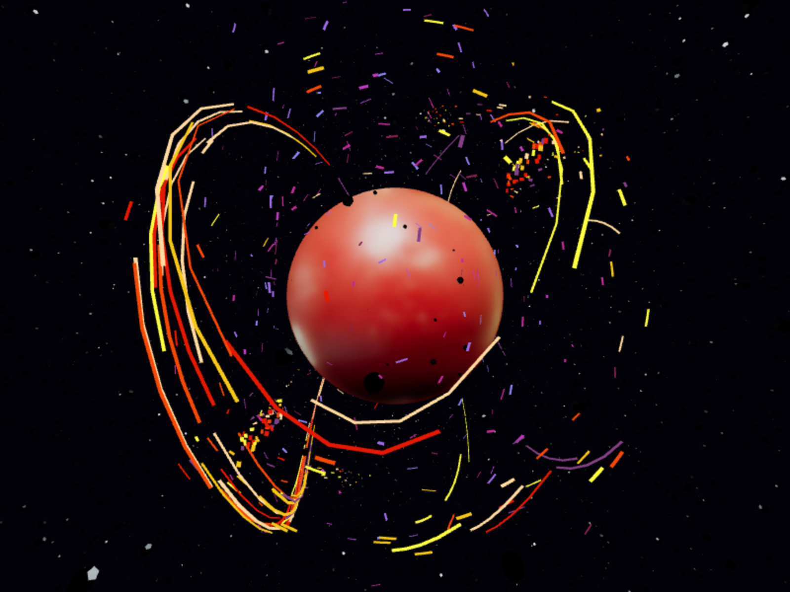

# 3d-particle-effects-demo

Code associated with the [Three ways to create 3D particle effects
](https://varun.ca/three-js-particles) post.

It demonstrates three techniques for creating particle systems

1. **Space Dust:** Using instanced meshes and oscillating their transforms.
2. **Sparks:** Using dashed lines with an animated offset.
3. **Spark storm:** By drawing a short line and advancing it step by step.

## Available Scripts

In the project directory, you can run:

### `yarn start`

Runs the app in the development mode.\
Open [http://localhost:3000](http://localhost:3000) to view it in the browser.

The page will reload if you make edits.\
You will also see any lint errors in the console.

### `yarn build`

Builds the app for production to the `build` folder.\
It correctly bundles React in production mode and optimizes the build for the best performance.

The build is minified and the filenames include the hashes.\
Your app is ready to be deployed!

See the section about [deployment](https://facebook.github.io/create-react-app/docs/deployment) for more information.
